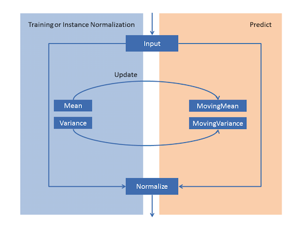

# Keras Mobilenet-Model  

Convert from tf-openpose to Keras.  
It worked on Keras, but it did not work on coreml.  
The reason is described below.

# How to use

* Run
```
$ python tensorToKeras.py
```

### DownLoad Model
- save to models folder
  - [model-388003](https://www.dropbox.com/s/09xivpuboecge56/mobilenet_0.75_0.50_model-388003.zip?dl=0) 

## Dependencies

```
numpy
h5py
scipy
opencv-python=3.3.0.10
coremltools=0.6.3
tensorflow=1.4.0
Keras=2.1.1 
Pillow=4.3.0
```

## Contributer

- [Infocom TPO](https://lab.infocom.co.jp/)
  - [@mganeko](https://github.com/mganeko)
  - [@mbotsu](https://github.com/mbotsu)
  - [@tnosho](https://github.com/tnosho)

## How to convert to CoreML
CoreML doesn't support instance_normalization.
And [tf-openpose-weight](https://www.dropbox.com/s/09xivpuboecge56/mobilenet_0.75_0.50_model-388003.zip?dl=0) that you can download from [original repository](https://github.com/ildoonet/tf-openpose) is trained with instance_normalization.
So, if you would like to convert to CoreML, you have to retrain without instance_normalization.([See this commit](https://github.com/infocom-tpo/tf-openpose/commit/2c6484888f6035054b897ddc35cbcc257f1c1cdf))
- tf-openpose .. BatchNormalization: instance_normalization supported
- coreml .. instance_normalization not supported

[Instance normalization removed in 0.4.0](https://forums.developer.apple.com/thread/81520)

**Retraining or coreml instance_normalization Waiting for support**




```
from keras.models import Model, load_model
import numpy as np
from PIL import Image
from keras.preprocessing.image import load_img, img_to_array
from keras.applications.mobilenet import DepthwiseConv2D
from keras.utils.generic_utils import CustomObjectScope
from keras import backend as K
import coremltools

img_path = '[filename]'
img = load_img(img_path, target_size=(368, 368))
kerasImg = img_to_array(img)
kerasImg = np.expand_dims(kerasImg, axis=0)

with CustomObjectScope({'DepthwiseConv2D': DepthwiseConv2D}):

    model = load_model('./output/predict.hd5')

    prediction = model.predict(kerasImg)
    prediction = prediction[0]

    coreml_model = coremltools.converters.keras.convert(model
        , input_names = 'image'
        , image_input_names='image'
        , output_names='net_output'
        , is_bgr=True
        , image_scale=2./255
        , red_bias=-1
        , green_bias=-1
        , blue_bias=-1
    )
    
    out = coreml_model.predict({'image': img})['net_output']

    coreml_model.author = 'Infocom TPO'
    coreml_model.license = 'MIT'
    coreml_model.save('mobilenet.mlmodel')
```